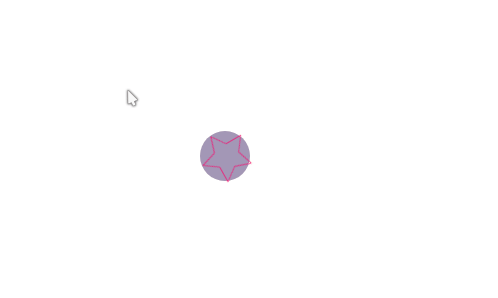

A demo using GSAP (greensock animation) in Electron with ClojureScript


# Resources:

* [GSAP V3 doc](https://greensock.com/docs/v3)
* [GSAP get started](https://greensock.com/get-started/)
* *SVG Animations* by Sarah Drasner

# Demo




```clojure
(let [tl (js/gsap.timeline (clj->js {:defaults {:visibility :visible
                                                ;; animation duration
                                                :duration   1
                                                :x          300
                                                :y          300

                                                ;; add call back for animation events
                                                :onComplete       (fn [& args]
                                                                    (t/info "balls animation completed with params: " args))
                                                ;; optionally pass arguments to callbacks, prints
                                                ;; => balls animation completed with params:  ("p1" "p2")
                                                :onCompleteParams (clj->js ["p1" "p2"])

                                                ;; :onUpdate    #(t/info "balls animation updated")
                                                :onStart #(t/info "balls animation started")
                                                ;; easeIn is good for exits
                                                ;; easeOut is good for entrance
                                                ;; easeInOut is good for intermediate stages
                                                :ease    "power4.easeOut"
                                                }}))
      [b1 b2 b3]    ["#ball1" "#ball2" "#ball3"]
      {:keys [w h]} (utils/window-size)]
  (.. tl
      ;; use `set` to configure initial state
      ;; normally you'd use fromTo method instead
      ;; (set ".ball" (clj->js {:visibility :visible}))

      ;; use label to create animation for a group of objects
      (add "burst")
      (fromTo b1 (clj->js {:x 50 :y 50 :background-color :red}) (clj->js {:opacity 0.2}) "burst")
      ;; use `+=` to add delay when animating an element
      (fromTo b2 (clj->js {:x (- w 50) :y 50 :background-color :green}) (clj->js {:opacity 0.2}) "burst+=0.2")
      (fromTo b3 (clj->js {:x (/ w 2) :y (- h 150) :background-color :blue}) (clj->js {:opacity 0.2}) "burst"))
  tl)
```
